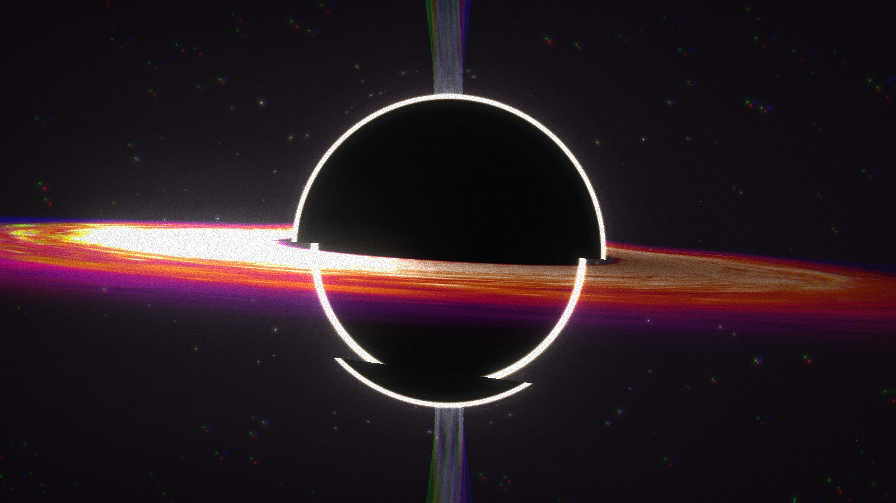
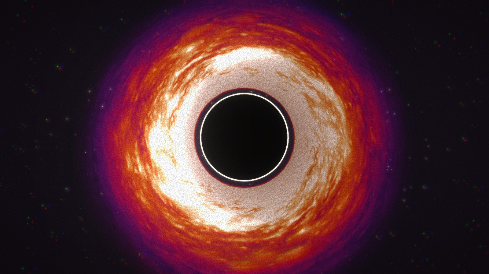
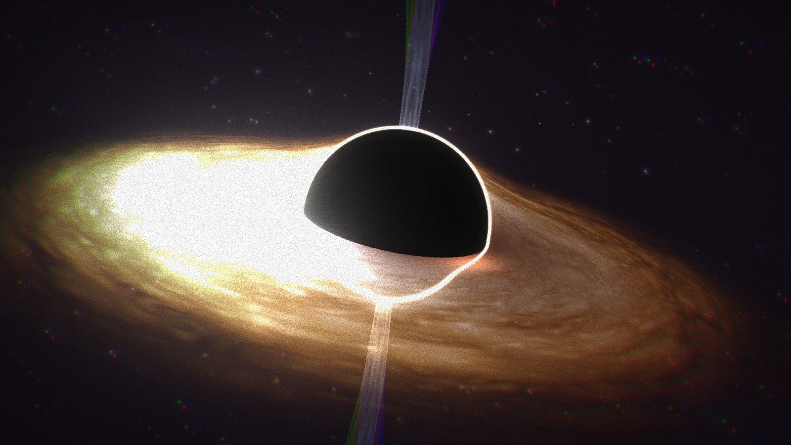
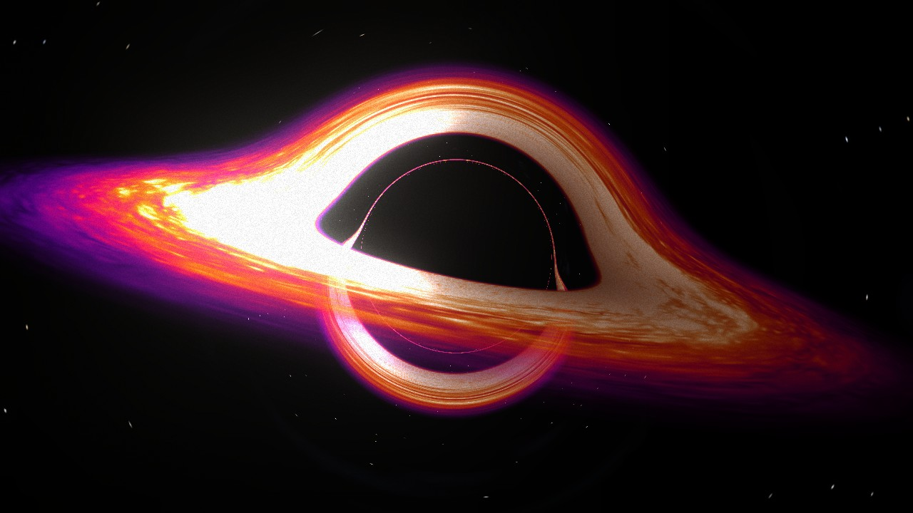
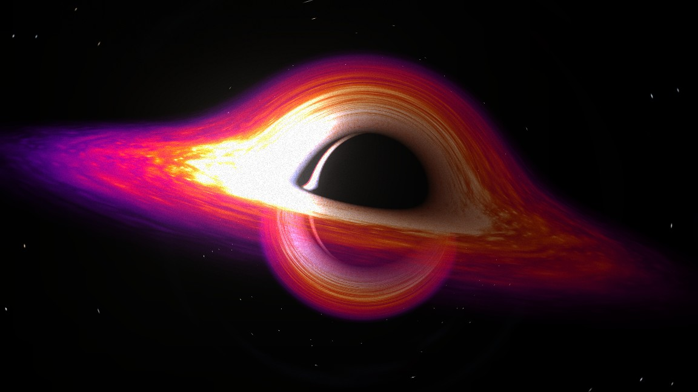
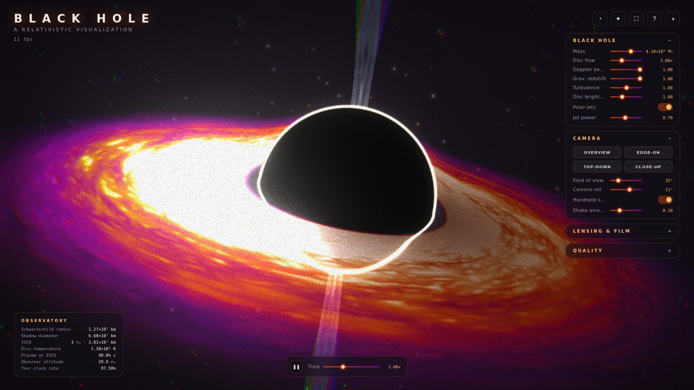

<div align="center">

# BLACK HOLE

**A real-time, physically grounded black hole in your browser.**

Keplerian accretion disc · relativistic Doppler beaming · gravitational redshift · photon ring · lensing · polar jets


</div>

---

Everything on screen is generated procedurally in GLSL — there is not a single texture file in the project. The scene is built in geometric units where the Schwarzschild radius is fixed, so the shadow, the photon ring, the inner edge of the disc and the plasma velocities always stay in physically correct proportion to each other.

## ✨ Features

**Physics**

- **Keplerian differential rotation** — disc plasma is advected with ω = √(GM/r³); the inner edge visibly laps the outer disc, shearing the turbulence into trailing spirals
- **Kerr spin** — drag the spin slider from Schwarzschild to near-extremal (a = 0.998): the ISCO follows the exact Bardeen–Press–Teukolsky formula (6M → 1.24M), so the disc reaches deeper, the plasma gets faster, Lense–Thirring frame dragging accelerates the flow, and the shadow tightens
- **Orbiting hot-spot flare** — a compact flare riding the flow just outside the inner edge at its true angular velocity, beamed and shifted like the plasma around it (the kind of orbiting spot the GRAVITY interferometer tracked around Sgr A*)
- **Geodesic photo mode** — press `P` and every pixel integrates a real null geodesic backwards from the camera: the shadow, the photon ring and the lensed arcs of the disc's far side above and below the hole all emerge from the geometry itself — nothing painted on. Schwarzschild uses the compact form d²x/dλ² = −3/2 rs h² x/r⁵; with spin the marcher switches to the **Kerr metric in Kerr–Schild coordinates**, integrated as a Hamiltonian system (H = ½[p² − E² − f(l·p+E)²]), so frame dragging, the displaced D-shaped shadow and the tightened prograde photon orbits appear for real. Bloom, grain and supersampled screenshots still apply
- **Living event horizon** — the shadow's core stays void-black, but its silhouette simmers with palette-tinted turbulence concentrated toward the disc plane, and the photon ring's brightness crawls with the flow — the hole reads as a presence, not a matte ball
- **Tidal disruption events** — press `T` and a star falls in on a parabolic orbit, stretches as it crosses the tidal radius, and is torn into 4 500 debris particles integrated with real gravity: about half escape, the rest rain back, circularize into the disc and feed an accretion flare that brightens the disc, the jets and the bloom before decaying away
- **Relativistic Doppler beaming** — the approaching limb flares up (δ³ intensity boost) and blueshifts, the receding limb fades and reddens, from the actual orbital β = √(rs/2r) ≈ 0.41 c at the inner edge
- **Gravitational redshift** — emission near the ISCO is dimmed and reddened by the combined orbital + gravitational time dilation √(1 − 3rs/2r)
- **Photon ring** — a bright, thin ring of once-orbiting light hugging the shadow at √27/2 · rs, the correct lensed silhouette radius
- **Accurate proportions** — event-horizon shadow, photon sphere, and disc truncation at the ISCO (3 rs) all derive from one Schwarzschild radius
- **Gravitational lensing** — a screen-space deflection field bends the star field and disc toward the hole, strongest near the photon sphere
- **Relativistic polar jets** — collimated, precessing plasma columns launched along the spin axis (toggleable)
- **Blackbody starfield** — 12 000 stars colored by real Planckian-locus temperatures (2 500 K – 25 000 K) with per-star scintillation
- **Live observatory HUD** — pick a mass from 1 M☉ to 10¹⁰ M☉ and read off the real Schwarzschild radius in km, shadow diameter, ISCO, disc temperature (T ∝ M^(−1/4)), plasma speed, and your own clock rate at the camera's altitude

**Experience**

- **Cinematic camera system** — damped orbit controls, four named viewpoints with eased flight transitions (`1–4`), an autonomous cinematic drift mode (`C`), adjustable FOV, roll and handheld micro-shake
- **Guided tour** — press `G` for a narrated flight through the physics: shadow, photon ring, beaming, ISCO, frame dragging… ending with a star being torn apart
- **Hover inspector** — rest the pointer on anything and get live physics for that exact spot: the disc's local radius in rₛ, orbital speed, temperature and whether that limb is beamed toward you; the shadow's real size for the chosen mass; the jets; a doomed star's stretching factor mid-plunge
- **Custom glass UI** — dependency-free control panel for every physics, camera and film parameter, collapsible sections, keyboard shortcuts, help overlay
- **Disc palette themes** — quasar (default), Gargantua amber, X-ray binary blue, ember
- **Procedural nebula backdrop** — wispy interstellar dust drifting behind the starfield, still zero texture files
- **Procedural ambient audio** — a brown-noise rumble and detuned drones synthesized live with WebAudio; the well sounds deeper and louder the closer you fall (opt-in)
- **Shareable views** — one click copies a link that restores your exact settings and camera angle
- **Film pipeline** — selective bloom, gravitationally-warped chromatic aberration, luminance-weighted animated grain, vignette — each with its own slider
- **The science inside** — press `I` for the full derivation sheet: every equation the scene uses (Schwarzschild radius through the Kerr–Schild Hamiltonian) with the papers they come from — Bardeen–Press–Teukolsky, Shakura–Sunyaev, Luminet, the Interstellar DNGR paper, GRAVITY and the EHT
- **First-visit onboarding** — the guided tour starts itself the first time someone opens the page (and never again after that)
- **Quality & comfort** — adaptive auto quality that lowers resolution when the frame rate dips, manual low/medium/high presets, FPS meter, time scale & pause, one-key PNG screenshots (`S`), fullscreen (`F`), one-click reset, `prefers-reduced-motion` support
- **Engineered to run lean** — every shader precompiles behind the intro (no mid-session compile stalls), the render loop allocates zero objects per frame, resizes and geometry rebuilds are coalesced, audio suspends in background tabs, and a full `destroy()` releases every GPU resource and listener

## 📸 Views

| Edge-on | Top-down |
| --- | --- |
|  |  |

Gargantua palette at spin a = 0.9 — the ISCO drops to 1.16 rs and the disc hugs the shadow:



Geodesic photo mode (`P`) — the same disc, but every pixel ray-marches a true null geodesic; the far side of the disc arcs over and under the shadow exactly as general relativity says it should:



Spin it up to a = 0.9 in geodesic mode and the marcher switches to the Kerr metric: the shadow shrinks, turns D-shaped with the flat edge on the approaching side, and a prograde photon arc ignites inside it — all from integrating the metric:





## 🚀 Setup

```bash
# Install dependencies (only the first time)
npm install

# Run the local server at localhost:5173
npm run dev

# Production build in dist/
npm run build
```

## 🎮 Controls

| Input | Action |
| --- | --- |
| drag / scroll | orbit and dolly around the singularity |
| hover | live physics for whatever you point at |
| `1` `2` `3` `4` | fly to overview / edge-on / top-down / close-up |
| `C` | cinematic mode (autonomous drift) |
| `G` | guided tour |
| `P` | geodesic photo mode |
| `I` | the science inside — equations & references |
| `T` | feed a star to the hole |
| `Space` | pause time |
| `S` | save a supersampled PNG screenshot |
| `F` | fullscreen |
| `H` | hide the interface |
| `K` | shortcuts panel |

Every parameter is also live in the side panel — mass, disc flow, beaming and redshift strength, turbulence, jets, lensing, bloom, grain, camera roll…

## 🔭 How the physics works

The scene uses geometric units with rs = 0.5 world units. From that single number:

| Quantity | Relation | World units |
| --- | --- | --- |
| Photon sphere | 1.5 rs | 0.75 |
| Shadow radius | √27/2 · rs | ≈ 1.30 |
| ISCO / disc inner edge | 3 rs | 1.5 |
| Orbital speed at radius r | β = √(rs / 2r) | 0.41 c at ISCO |

The disc fragment shader advects four octaves of periodic perlin noise with the local Keplerian angular velocity — split into a rigid rotation plus a bounded, flow-map-crossfaded differential shear so the turbulence churns forever without winding into static filaments, while a radial drift keeps the plasma visibly falling inward. It then applies the relativistic Doppler factor δ = 1/γ(1 − β·cos θ) as a δ³ intensity boost with a spectral tilt, and the time-dilation factor √(1 − 3rs/2r) as dimming and reddening. The mass slider never rescales the scene — Schwarzschild geometry is scale-free — it drives the real-unit readouts in the HUD instead.

The lensing is a screen-space approximation: two masks (a camera-facing halo and an in-plane disc field) are rendered to a deflection buffer, and the composition pass bends sample coordinates toward the singularity's projected position with that strength — cheap enough for any GPU, convincing enough to smear the star field around the shadow.

## 🗂 Project structure

```
sources/
├── index.js                 # entry
├── experience/
│   ├── Experience.js        # orchestrator, render pipeline, post-processing
│   ├── Physics.js           # Schwarzschild model + real-unit readouts
│   ├── Disc.js              # accretion disc (ISCO-truncated, palettes, hot spot)
│   ├── BlackHole.js         # shadow + photon ring
│   ├── Jets.js              # relativistic polar jets
│   ├── TidalDisruption.js   # star infall, debris n-body, accretion flare
│   ├── Stars.js             # blackbody starfield
│   ├── Nebula.js            # procedural background dust
│   ├── Noises.js            # baked perlin octaves render target
│   ├── Distortion.js        # lensing deflection field
│   ├── GeodesicView.js      # ray-marched photo mode
│   ├── CameraRig.js         # orbit + presets + cinematic mode
│   ├── AmbientAudio.js      # WebAudio soundscape
│   └── UI.js                # control panel, HUD, shortcuts
└── shaders/                 # all GLSL (disc, stars, photonRing, jet, nebula,
                             # distortion, composition, film, noises)
```

## 👤 Author

**ibra-kdbra** — shader breakdowns live in [`sources/shaders/README.md`](./sources/shaders/README.md)
